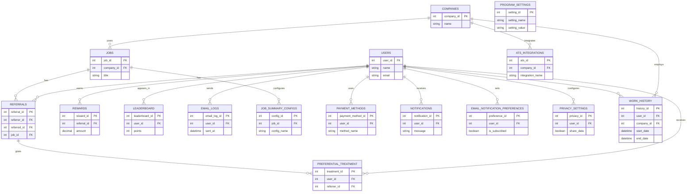

# Enterprise Architecture Assessment: Refermate-0.0.7

**Generated:** 2025-09-15T06:39:23.691Z
**Change Request:** Adding a new feature which will give preferential treatment to the profiles of the candidates who has work history directly with the referrrer in the past companies

## Table of Contents

1. [Repository Analysis](#repository-analysis)
2. [Change Request Assessment](#change-request-assessment)
3. [Database Schema & ER Diagram](#database-schema--er-diagram)

---

## Repository Analysis

### Structure
- **Type:** node
- **Framework:** React
- **Languages:** JavaScript, TypeScript

### Database
- **Type:** Not detected
- **Tables:** 14 tables
- **Existing Tables:** companies, users, jobs, referrals, rewards, leaderboard, ats_integrations, email_logs, job_summary_configs, payment_methods (and 4 more)

### API
- **Type:** REST
- **Endpoints:** 0 routes
- **Controllers:** 0
- **Services:** 0

### Frontend
- **Framework:** Not detected
- **Components:** 7
- **Pages:** 0
- **State Management:** None
- **Styling:** Tailwind CSS

### Architecture Patterns
- **Architecture:** monolithic
- **Testing:** Not detected
- **CI/CD:** Not configured
- **Containerization:** Yes
- **Authentication:** JWT

---

## Change Request Assessment

# Change Request Document

## Executive Summary

### Business Objectives
The objective of this change request is to implement a new feature that provides preferential treatment to candidate profiles who have a direct work history with the referrer in past companies. This feature aims to enhance the referral process by prioritizing candidates with a proven track record with trusted individuals, thereby increasing the likelihood of successful hires and improving the overall efficiency of the recruitment process.

## Functional Requirements (FR)

### FR1: Candidate Profile Prioritization
- **Description**: Enhance the candidate profile ranking system to prioritize candidates with a direct work history with the referrer.
- **Acceptance Criteria**:
  - The system identifies candidates with past work history with the referrer.
  - Such candidates are ranked higher in the referral system.
  - The ranking adjustment is visible on the user interface.

### FR2: Work History Validation
- **Description**: Validate the work history data between candidates and referrers.
- **Acceptance Criteria**:
  - Data should be retrieved from the `companies` and `users` tables to establish connections.
  - Only verified connections should be used for prioritization.

## Non-functional Requirements (NFR)

### Security
- Implement data encryption for sensitive user and company data.
- Ensure secure API endpoints using JWT authentication.

### Performance
- The feature should not degrade system performance; response times should remain below 200ms for profile ranking queries.

### Privacy
- Ensure user consent is obtained before processing historical work data.
- Comply with GDPR regulations for data processing.

## Data Model Changes

### SQL Migrations
```sql
ALTER TABLE referrals ADD COLUMN referrer_candidate_priority INT DEFAULT 0;

CREATE TABLE work_history (
    work_history_id SERIAL PRIMARY KEY,
    user_id INT REFERENCES users(user_id),
    company_id INT REFERENCES companies(company_id),
    referrer_id INT REFERENCES users(user_id),
    start_date DATE NOT NULL,
    end_date DATE NULL
);

CREATE INDEX idx_user_company ON work_history(user_id, company_id);
```

### ER Diagram (Mermaid)
```mermaid
erDiagram
    COMPANIES {
        INT company_id PK
        STRING name
        ...
    }
    USERS {
        INT user_id PK
        STRING name
        STRING email
        ...
    }
    JOBS {
        INT job_id PK
        STRING title
        ...
    }
    REFERRALS {
        INT referral_id PK
        INT referrer_candidate_priority
        ...
    }
    REWARDS {
        INT reward_id PK
        ...
    }
    LEADERBOARD {
        INT leaderboard_id PK
        ...
    }
    ATS_INTEGRATIONS {
        INT ats_integration_id PK
        ...
    }
    EMAIL_LOGS {
        INT email_log_id PK
        ...
    }
    JOB_SUMMARY_CONFIGS {
        INT config_id PK
        ...
    }
    PAYMENT_METHODS {
        INT method_id PK
        ...
    }
    NOTIFICATIONS {
        INT notification_id PK
        ...
    }
    EMAIL_NOTIFICATION_PREFERENCES {
        INT preference_id PK
        ...
    }
    PRIVACY_SETTINGS {
        INT setting_id PK
        ...
    }
    PROGRAM_SETTINGS {
        INT setting_id PK
        ...
    }
    WORK_HISTORY {
        INT work_history_id PK
        INT user_id FK
        INT company_id FK
        INT referrer_id FK
        DATE start_date
        DATE end_date
    }
    USERS ||--o{ WORK_HISTORY : has
    COMPANIES ||--o{ WORK_HISTORY : employs
    USERS ||--o{ REFERRALS : refers
```

## API Modifications

### New Endpoint: `/api/referrals/prioritize`
- **Method**: POST
- **Request Schema**:
  ```json
  {
      "referralId": "integer",
      "userId": "integer",
      "referrerId": "integer"
  }
  ```
- **Response Schema**:
  ```json
  {
      "status": "string",
      "message": "string"
  }
  ```

## Frontend Changes

### Component Specifications

#### CandidateProfile
- **Props**: `candidateId`, `referrerId`
- **State**: `workHistory`, `priorityScore`
- **Behavior**: Fetch and display priority score based on work history.

## Implementation Steps

### Phase 1: Database Changes
- Implement SQL migrations to update schema.
- Populate `work_history` table with historical data.

### Phase 2: API Development
- Develop and test the new API endpoint.
- Ensure integration with existing authentication.

### Phase 3: Frontend Integration
- Update React components to display priority information.
- Enhance UI to highlight prioritized candidates.

### Phase 4: Testing
- Conduct unit and integration tests.
- Validate performance and security measures.

## Technical Considerations

### Performance
- Optimize queries for retrieving work history.
- Implement caching mechanisms for frequently accessed data.

### Security
- Ensure all data exchanges are encrypted.
- Validate API requests using JWT tokens.

### Scalability
- Design database schema for easy scaling.
- Use indexing to enhance query performance.

## Observability Requirements

### Metrics
- Track API request counts and response times.
- Monitor database query performance.

### SLAs
- Ensure 99.9% uptime for the new feature.
- Response times must remain under 200ms.

## Rollout Plan

### Feature Flags
- Implement feature flags to control the rollout.
- Enable gradual user exposure to the new feature.

## Risk Assessment and Mitigations

### Risks
- Data breaches due to improper handling of historical data.
- Performance degradation due to complex queries.

### Mitigations
- Implement strong data encryption and access controls.
- Optimize database queries and use caching strategies.

## Code Examples

### Backend: Prioritize Referral
```javascript
const prioritizeReferral = async (referralId, userId, referrerId) => {
    const workHistory = await db.query(`
        SELECT * FROM work_history 
        WHERE user_id = $1 AND referrer_id = $2
    `, [userId, referrerId]);

    if (workHistory.rows.length > 0) {
        await db.query(`
            UPDATE referrals
            SET referrer_candidate_priority = 1
            WHERE referral_id = $1
        `, [referralId]);

        return { status: 'success', message: 'Candidate prioritized.' };
    }
    return { status: 'error', message: 'No work history found.' };
};
```

### Frontend: Display Priority
```jsx
const CandidateProfile = ({ candidateId, referrerId }) => {
    const [priorityScore, setPriorityScore] = useState(0);

    useEffect(() => {
        fetch(`/api/referrals/prioritize`, {
            method: 'POST',
            headers: { 'Content-Type': 'application/json' },
            body: JSON.stringify({ candidateId, referrerId })
        })
        .then(res => res.json())
        .then(data => {
            if (data.status === 'success') {
                setPriorityScore(1);
            }
        });
    }, [candidateId, referrerId]);

    return (
        <div className={`candidate-profile ${priorityScore ? 'highlight' : ''}`}>
            {/* Candidate details... */}
            {priorityScore ? <span>Priority Candidate</span> : null}
        </div>
    );
};
```

This comprehensive document should guide the implementation team through the necessary changes to successfully add the new feature.

---

## Database Schema & ER Diagram



