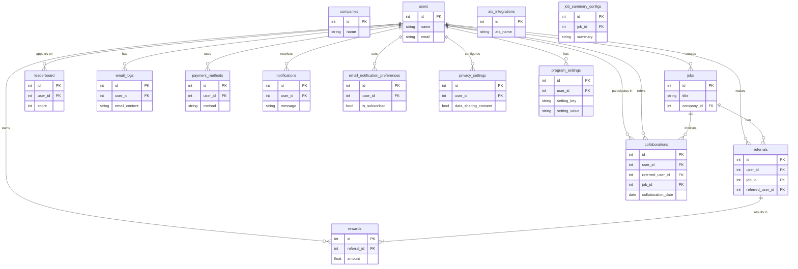
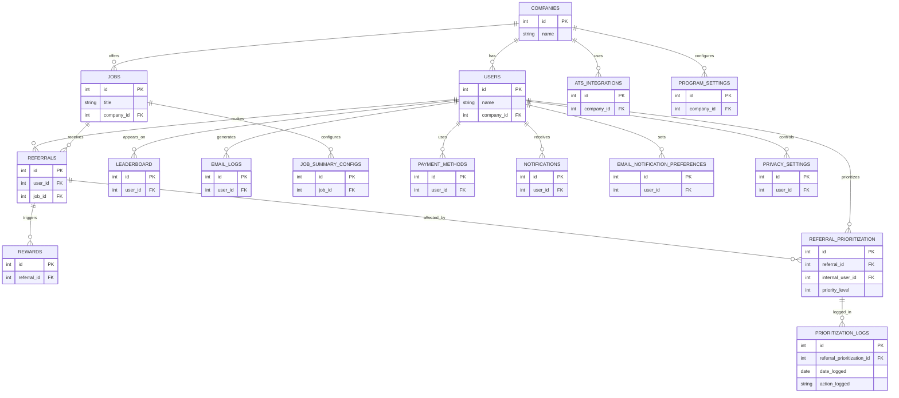

# Enterprise Architecture Assessment: Refermate-0.0.7

**Generated:** 2025-09-16T04:53:52.389Z
**Change Request:** Need to create a new feature for implementing referral prioritization from internal candidates who has worked with the referred candidates in teh past 

## Table of Contents

1. [Repository Analysis](#repository-analysis)
2. [Change Request Assessment](#change-request-assessment)
3. [Database Schema & ER Diagram](#database-schema--er-diagram)

---

## Repository Analysis

### Structure
- **Type:** node
- **Framework:** React
- **Languages:** JavaScript, TypeScript

### Database
- **Type:** Not detected
- **Tables:** 14 tables
- **Existing Tables:** companies, users, jobs, referrals, rewards, leaderboard, ats_integrations, email_logs, job_summary_configs, payment_methods (and 4 more)

### API
- **Type:** REST
- **Endpoints:** 0 routes
- **Controllers:** 0
- **Services:** 0

### Frontend
- **Framework:** Not detected
- **Components:** 7
- **Pages:** 0
- **State Management:** None
- **Styling:** Tailwind CSS

### Architecture Patterns
- **Architecture:** monolithic
- **Testing:** Not detected
- **CI/CD:** Not configured
- **Containerization:** Yes
- **Authentication:** JWT

---

## Change Request Assessment

# Change Request Document: Refermate-0.0.7

## Executive Summary

### Business Objectives
Our goal is to enhance the referral system by introducing a feature that prioritizes referrals from internal candidates who have previously worked with the referred individual. This feature aims to improve the quality and relevance of referrals, thereby increasing hiring efficiency and candidate satisfaction.

## Detailed Functional Requirements

### Functional Requirement 1: Referral Prioritization
- **Description:** Implement a system to prioritize referrals based on past collaboration between the referrer and the referred candidate.
- **Acceptance Criteria:**
  - The system should identify and prioritize referrals from users who have a documented history of working with the referred candidate.
  - The priority is reflected in the referral processing queue.
  - Users must be notified of their referral's prioritized status.

### Functional Requirement 2: User Interface Update
- **Description:** Update the frontend interface to display prioritized referrals.
- **Acceptance Criteria:**
  - The referral list UI should clearly indicate prioritized referrals.
  - Include a tooltip or label explaining the prioritization to the user.
  - Ensure the UI is responsive and maintains existing style guidelines using Tailwind CSS.

## Non-functional Requirements

### Security
- Ensure data related to prior collaborations is encrypted at rest and in transit.
- Implement access controls to restrict data access based on user roles.

### Performance
- The prioritization feature should not degrade the referral processing time by more than 10%.
- Ensure UI updates are performant and load efficiently.

### Privacy
- User consent must be obtained before using historical collaboration data for referral prioritization.
- Ensure compliance with GDPR regarding user data processing.

## Data Model Changes

### New Table: `collaborations`
```sql
CREATE TABLE collaborations (
    id SERIAL PRIMARY KEY,
    user_id INT NOT NULL,
    referred_user_id INT NOT NULL,
    job_id INT,
    collaboration_date DATE,
    FOREIGN KEY (user_id) REFERENCES users(id),
    FOREIGN KEY (referred_user_id) REFERENCES users(id),
    FOREIGN KEY (job_id) REFERENCES jobs(id)
);
```

### ER Diagram



## API Modifications

### New Endpoint: `/api/referrals/prioritize`
- **Method:** POST
- **Request Schema:**
  ```json
  {
    "user_id": "integer",
    "referred_user_id": "integer",
    "job_id": "integer"
  }
  ```
- **Response Schema:**
  ```json
  {
    "status": "string",
    "message": "string"
  }
  ```

## Frontend Changes

### Component Specification: ReferralList
- **Description:** Update the existing `ReferralList` component to display prioritized referrals.
- **Specifications:**
  - Add a badge next to prioritized referrals.
  - Tooltip: "This referral is prioritized due to previous collaboration."
  - Ensure the component uses Tailwind CSS for styling.

## Implementation Steps

### Phase 1: Backend Development
- Implement the new `collaborations` table.
- Develop the prioritization logic in the backend.

### Phase 2: Frontend Development
- Update the `ReferralList` component.
- Implement new styles and tooltips using Tailwind CSS.

### Phase 3: Testing
- Conduct unit tests for backend logic.
- Perform UI testing for the updated referral list.

### Phase 4: Deployment
- Deploy changes to a staging environment for user acceptance testing.
- Roll out to production with feature flags.

## Technical Considerations

### Performance
- Optimize database queries related to the `collaborations` table.
- Ensure efficient data retrieval and caching mechanisms.

### Security
- Implement role-based access controls.
- Ensure secure API endpoints with JWT authentication.

### Scalability
- Design the `collaborations` table for scalability with indexing on key columns.

## Observability Requirements

### Metrics
- Track the number of prioritized referrals processed.

### SLAs
- Ensure referral processing time does not exceed 2 seconds.

## Rollout Plan

### Feature Flags
- Use feature flags to enable the new prioritization feature gradually.
- Monitor the system for any performance impact.

## Risk Assessment and Mitigations

### Risks
- Potential data privacy concerns with collaboration history.
- Possible performance impact due to additional prioritization logic.

### Mitigations
- Implement strict data privacy measures.
- Conduct performance testing and optimize queries.

## Code Examples

### Backend Example: Prioritization Logic
```javascript
async function prioritizeReferral(userId, referredUserId, jobId) {
  // Check for existing collaborations
  const collaborations = await db('collaborations')
    .where({ user_id: userId, referred_user_id: referredUserId })
    .select();

  if (collaborations.length > 0) {
    // Logic to prioritize the referral
    return { status: 'success', message: 'Referral prioritized' };
  } else {
    return { status: 'fail', message: 'No prior collaboration found' };
  }
}
```

### Frontend Example: ReferralList Update
```jsx
import React from 'react';

const ReferralList = ({ referrals }) => {
  return (
    <ul>
      {referrals.map((referral) => (
        <li key={referral.id} className="flex items-center">
          <span>{referral.name}</span>
          {referral.isPrioritized && (
            <span className="ml-2 bg-blue-100 text-blue-800 text-xs font-semibold mr-2 px-2.5 py-0.5 rounded">
              Prioritized
            </span>
          )}
        </li>
      ))}
    </ul>
  );
};

export default ReferralList;
```

This document provides a comprehensive guide for implementing the requested change, ensuring all teams involved have the detailed information needed for successful execution.

---

## Database Schema & ER Diagram



