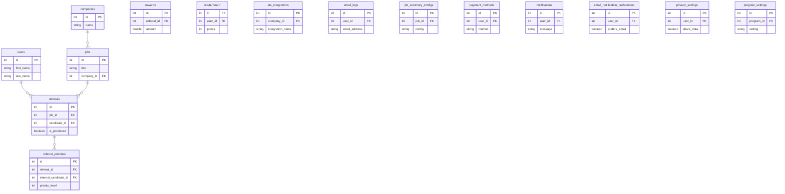
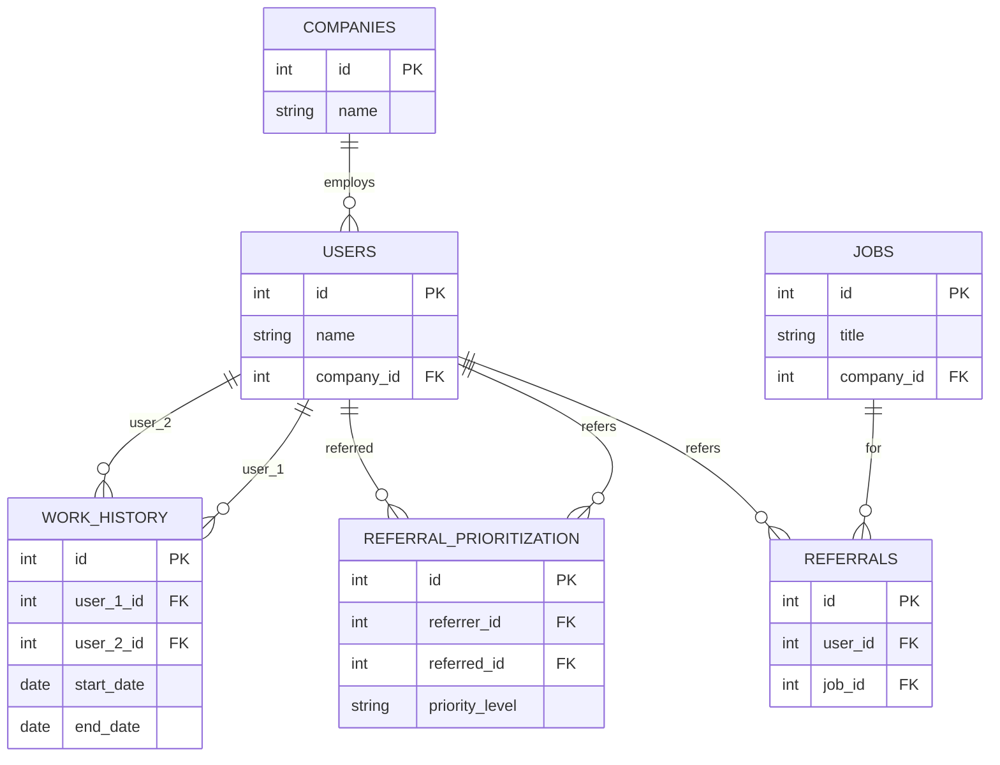

# Enterprise Architecture Assessment: Refermate-0.0.7

**Generated:** 2025-09-16T05:28:57.187Z
**Change Request:** Need to create a new feature for implementing referral prioritization from internal candidates who has worked with the referred candidates in the past

## Table of Contents

1. [Repository Analysis](#repository-analysis)
2. [Change Request Assessment](#change-request-assessment)
3. [Database Schema & ER Diagram](#database-schema--er-diagram)

---

## Repository Analysis

### Structure
- **Type:** node
- **Framework:** React
- **Languages:** JavaScript, TypeScript

### Database
- **Type:** Not detected
- **Tables:** 14 tables
- **Existing Tables:** companies, users, jobs, referrals, rewards, leaderboard, ats_integrations, email_logs, job_summary_configs, payment_methods (and 4 more)

### API
- **Type:** REST
- **Endpoints:** 0 routes
- **Controllers:** 0
- **Services:** 0

### Frontend
- **Framework:** Not detected
- **Components:** 7
- **Pages:** 0
- **State Management:** None
- **Styling:** Tailwind CSS

### Architecture Patterns
- **Architecture:** monolithic
- **Testing:** Not detected
- **CI/CD:** Not configured
- **Containerization:** Yes
- **Authentication:** JWT

---

## Change Request Assessment

# Change Request Document: Referral Prioritization Feature

## Executive Summary

### Business Objectives
The objective of this change request is to implement a referral prioritization feature that allows internal candidates to prioritize their referrals based on past collaborations with the referred candidates. This feature aims to improve the quality of referrals and increase the likelihood of successful hires by leveraging the existing network and experience of internal candidates.

## Functional Requirements

### FR1: Internal Candidate Referral Prioritization
- **Description**: Enable internal candidates to prioritize their referrals if they have previously worked with the referred candidate.
- **Acceptance Criteria**:
  - The system shall allow internal candidates to mark a referral as prioritized if there is a past working relationship with the referred candidate.
  - Prioritized referrals shall be displayed with a higher priority in the referral list.
  - The referral prioritization shall be visible to hiring managers.

### FR2: Relationship Verification
- **Description**: Verify the past working relationship between the internal candidate and the referred candidate.
- **Acceptance Criteria**:
  - The system shall cross-reference the work history of the internal candidate and referred candidate.
  - Verification shall include a prompt for the internal candidate to provide details of the past collaboration.

## Non-Functional Requirements

### Security
- All referral prioritization actions must be authenticated using JWT.
- Ensure data encryption for all referral information.

### Performance
- The prioritization feature should not introduce more than a 100ms delay in the referral processing pipeline.

### Privacy
- Ensure compliance with GDPR by allowing users to manage their privacy settings regarding referral information.

## Data Model Changes

### SQL Migrations
```sql
-- New table to store referral priorities
CREATE TABLE referral_priorities (
    id SERIAL PRIMARY KEY,
    referral_id INT REFERENCES referrals(id) ON DELETE CASCADE,
    internal_candidate_id INT REFERENCES users(id),
    priority_level INT NOT NULL,
    created_at TIMESTAMP DEFAULT CURRENT_TIMESTAMP
);

-- Alter referrals table to include priority flag
ALTER TABLE referrals ADD COLUMN is_prioritized BOOLEAN DEFAULT FALSE;

-- Example migration for demo data
INSERT INTO referral_priorities (referral_id, internal_candidate_id, priority_level)
VALUES (1, 2, 5);
```

### ER Diagram (Mermaid)


## API Modifications

### New Endpoint: Prioritize Referral
- **Endpoint**: POST /api/referrals/:id/prioritize
- **Request Schema**:
  ```json
  {
      "internal_candidate_id": 123,
      "priority_level": 5
  }
  ```
- **Response Schema**:
  ```json
  {
      "status": "success",
      "message": "Referral prioritized successfully"
  }
  ```

## Frontend Changes

### Component: ReferralCard
- **Specifications**:
  - Add a button to prioritize the referral if the user is an internal candidate.
  - Display an icon indicating the referral's priority status.

### Component: ReferralList
- **Specifications**:
  - Sort referrals by priority level.
  - Show prioritized referrals at the top of the list.

## Implementation Steps

### Phase 1: Data Model Changes
- Implement SQL migrations to create the `referral_priorities` table.
- Update the `referrals` table to include the `is_prioritized` column.

### Phase 2: Backend Development
- Develop the API endpoint for prioritizing referrals.
- Implement relationship verification logic.

### Phase 3: Frontend Development
- Update `ReferralCard` and `ReferralList` components to display prioritization options and status.

### Phase 4: Testing
- Conduct unit and integration tests for new features.
- Perform performance testing to ensure minimal impact.

## Technical Considerations

### Performance
- Optimize database queries for prioritization lookups.

### Security
- Ensure JWT tokens are validated for all prioritization actions.

### Scalability
- Design the prioritization feature to handle an increasing number of referrals without degradation.

## Observability Requirements

### Metrics
- Track the number of prioritized referrals and time to prioritize.

### SLAs
- Ensure the referral prioritization feature has an uptime of 99.9%.

## Rollout Plan

### Feature Flags
- Use feature flags to enable the referral prioritization feature in stages.

## Risk Assessment and Mitigations

### Risks
- Data inconsistency due to race conditions.
- Performance degradation with large datasets.

### Mitigations
- Implement database transactions to maintain data consistency.
- Use database indexing to enhance query performance.

## Code Examples

### Backend Example: Prioritize Referral Endpoint
```javascript
const express = require('express');
const router = express.Router();
const { prioritizeReferral } = require('../services/referralService');

router.post('/api/referrals/:id/prioritize', async (req, res) => {
    const referralId = req.params.id;
    const { internal_candidate_id, priority_level } = req.body;
    try {
        await prioritizeReferral(referralId, internal_candidate_id, priority_level);
        res.json({ status: 'success', message: 'Referral prioritized successfully' });
    } catch (error) {
        res.status(500).json({ status: 'error', message: error.message });
    }
});

module.exports = router;
```

### Frontend Example: ReferralCard Component
```jsx
import React from 'react';

const ReferralCard = ({ referral, onPrioritize }) => {
    const handlePrioritize = () => {
        onPrioritize(referral.id);
    };

    return (
        <div className="referral-card">
            <h3>{referral.candidateName}</h3>
            <button onClick={handlePrioritize} className="prioritize-btn">
                Prioritize
            </button>
        </div>
    );
};

export default ReferralCard;
```

This document provides a detailed and comprehensive plan to implement the referral prioritization feature, ensuring alignment with the existing codebase and architecture.

---

## Database Schema & ER Diagram



