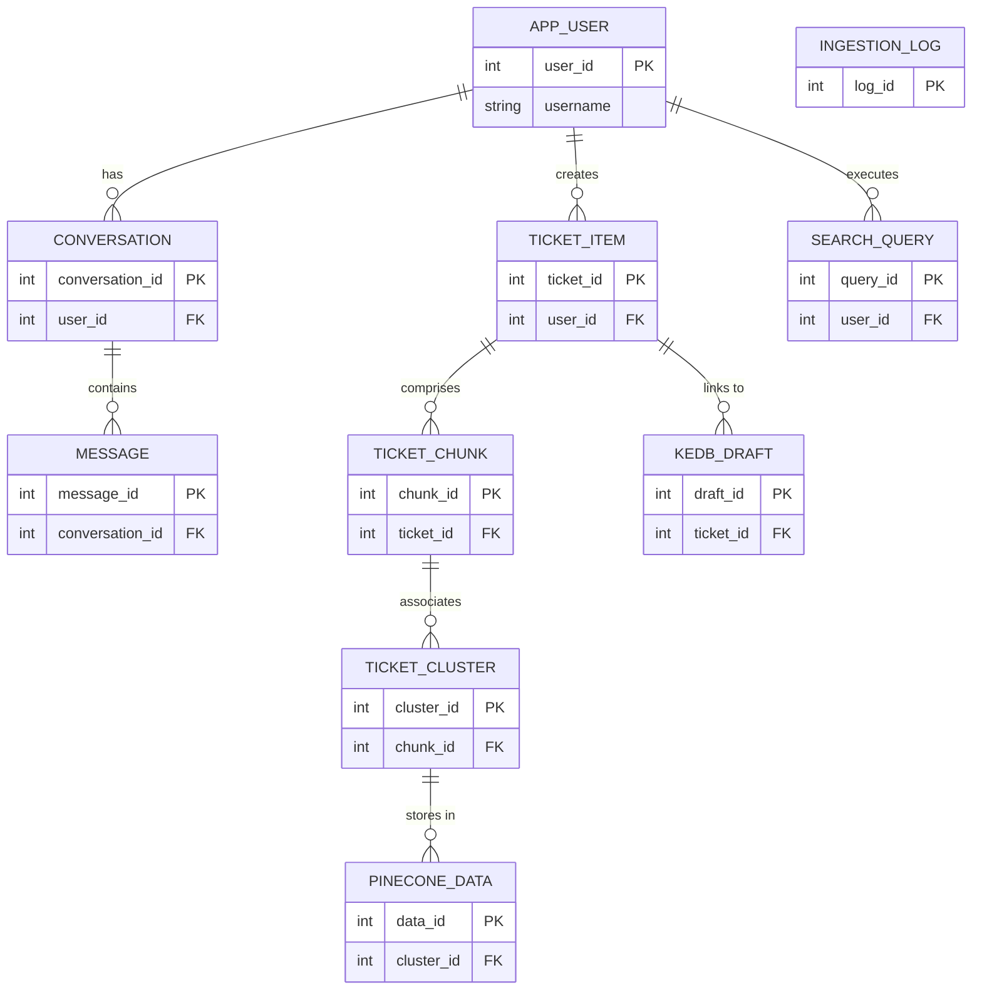

# Enterprise Architecture Assessment: vialtokms

**Generated:** 2025-09-15T05:15:00.477Z
**Change Request:** To migrate the application codebase from ChromaDB to PineconeDB

## Table of Contents

1. [Repository Analysis](#repository-analysis)
2. [Change Request Assessment](#change-request-assessment)
3. [Database Schema & ER Diagram](#database-schema--er-diagram)

---

## Repository Analysis

### Structure
- **Type:** unknown
- **Framework:** Custom
- **Languages:** 

### Database
- **Type:** Not detected
- **Tables:** 9 tables
- **Existing Tables:** app_user, conversation, message, ticket_item, ticket_chunk, ticket_cluster, kedb_draft, ingestion_log, search_query

### API
- **Type:** REST
- **Endpoints:** 0 routes
- **Controllers:** 0
- **Services:** 0

### Frontend
- **Framework:** Not detected
- **Components:** 0
- **Pages:** 0
- **State Management:** None
- **Styling:** Tailwind CSS

### Architecture Patterns
- **Architecture:** monolithic
- **Testing:** Not detected
- **CI/CD:** Not configured
- **Containerization:** Yes
- **Authentication:** Custom

---

## Change Request Assessment

```markdown
# Change Request Document: Migration from ChromaDB to PineconeDB

## Executive Summary
The objective of this change request is to migrate the existing application's database from ChromaDB to PineconeDB. This migration aims to leverage PineconeDB's advanced vector search capabilities to improve the application's search performance and scalability. The migration will enhance data retrieval efficiency, support advanced search functionalities, and ensure seamless integration with existing application infrastructure.

## Detailed Functional Requirements (FR)
1. **FR001: Data Migration**
   - **Acceptance Criteria**: All existing data from ChromaDB must be successfully migrated to PineconeDB without data loss or corruption.

2. **FR002: Search Functionality**
   - **Acceptance Criteria**: The application must support advanced vector search capabilities provided by PineconeDB, ensuring improved accuracy and performance.

3. **FR003: API Integration**
   - **Acceptance Criteria**: Modify existing application logic to interact with PineconeDB using its API endpoints.

## Non-Functional Requirements (NFR)
1. **Security**
   - Data encryption must be maintained during migration and in the PineconeDB environment.
   - Access controls and authentication must be configured to ensure secure data access.

2. **Performance**
   - The migration process should not exceed a downtime of 2 hours.
   - Query response times should be reduced by at least 30% compared to ChromaDB.

3. **Privacy**
   - Ensure compliance with data privacy regulations during and after migration.

## Complete Data Model Changes
- **ER Diagram**:
  ```mermaid
  erDiagram
      app_user {
          int id PK
          varchar username
          varchar email
      }
      conversation {
          int id PK
          int app_user_id FK
          datetime start_time
      }
      message {
          int id PK
          int conversation_id FK
          text content
          datetime timestamp
      }
      ticket_item {
          int id PK
          varchar title
          text description
      }
      ticket_chunk {
          int id PK
          int ticket_item_id FK
          text chunk_content
      }
      ticket_cluster {
          int id PK
          int ticket_item_id FK
          text cluster_data
      }
      kedb_draft {
          int id PK
          text draft_content
      }
      ingestion_log {
          int id PK
          datetime ingested_at
          text details
      }
      search_query {
          int id PK
          int app_user_id FK
          text query_text
          datetime executed_at
      }
      pinecone_vector {
          int id PK
          int source_id FK
          vector vector_data
      }

      app_user ||--o{ conversation: ""
      conversation ||--o{ message: ""
      ticket_item ||--o{ ticket_chunk: ""
      ticket_item ||--o{ ticket_cluster: ""
      app_user ||--o{ search_query: ""
      pinecone_vector ||--o{ search_query: ""
  ```

- **SQL Migrations**:
  ```sql
  CREATE TABLE pinecone_vector (
      id SERIAL PRIMARY KEY,
      source_id INT REFERENCES search_query(id),
      vector VECTOR_TYPE -- Assuming PineconeDB supports a vector type
  );
  ```

## API Modifications
- **Request Schema**:
  ```json
  {
      "query": "string",
      "filter": "object"
  }
  ```

- **Response Schema**:
  ```json
  {
      "results": [
          {
              "id": "integer",
              "score": "float",
              "data": "object"
          }
      ]
  }
  ```

## Frontend Changes
- **Component Specifications**:
  - Implement a new search component that utilizes PineconeDB's API for vector searches.
  - Update styling using Tailwind CSS to maintain consistency with existing UI.

## Implementation Steps
1. **Phase 1: Preparation**
   - Set up a PineconeDB instance.
   - Develop migration scripts for data transfer.

2. **Phase 2: Migration**
   - Execute data migration scripts.
   - Validate data integrity post-migration.

3. **Phase 3: Integration**
   - Update application logic to interact with PineconeDB.
   - Modify frontend components to use new search capabilities.

4. **Phase 4: Testing**
   - Perform comprehensive testing to ensure functionality and performance.

5. **Phase 5: Deployment**
   - Deploy changes to the production environment.

## Technical Considerations
- **Performance**: Optimize database queries to leverage PineconeDB's indexing and search capabilities.
- **Security**: Ensure secure data transfer protocols during migration.
- **Scalability**: PineconeDB's architecture should support future data growth and increased query loads.

## Observability Requirements
- **Metrics**: Monitor query response times, data ingestion rates, and error rates.
- **SLAs**: Ensure 99.9% uptime for the database service.

## Rollout Plan
- Implement feature flags to control the rollout of new search functionalities to a subset of users for initial feedback and testing.

## Risk Assessment and Mitigations
- **Data Loss**: Conduct thorough data validation post-migration.
- **Downtime**: Schedule migration during low-traffic periods to minimize impact.
- **Performance Issues**: Continuously monitor and optimize query performance.

## Actual Code Examples
```python
# Sample script to migrate data to PineconeDB
import pinecone

pinecone.init(api_key="your-api-key")

# Assuming existing data is retrieved from ChromaDB
existing_data = get_data_from_chromadb()

# Insert into PineconeDB
for record in existing_data:
    pinecone.upsert(
        index_name="your-index-name",
        items=[{
            'id': record['id'],
            'vector': record['vector_data'],
            'metadata': record
        }]
    )
```

This detailed document provides a structured approach to migrate from ChromaDB to PineconeDB, ensuring the implementation team has the necessary information and steps to execute the change effectively.
```

---

## Database Schema & ER Diagram




