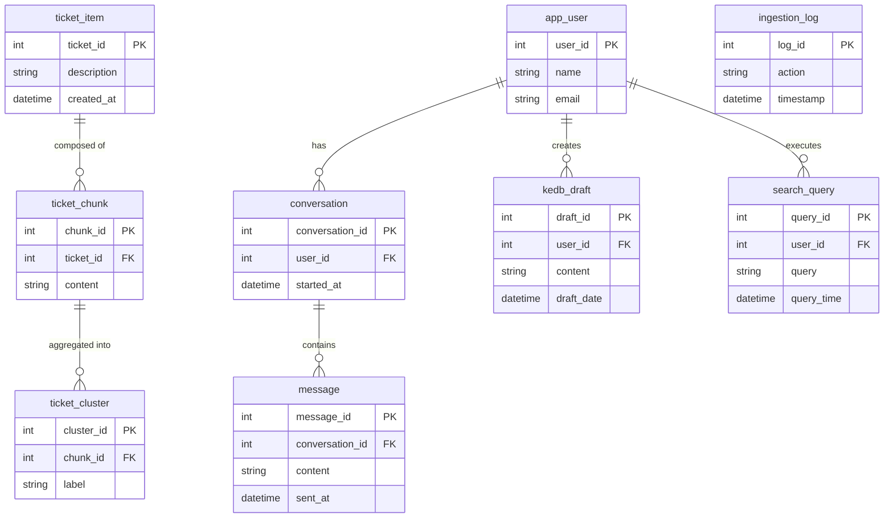

# Enterprise Architecture Assessment: vialtokms

**Generated:** 2025-09-15T06:36:15.752Z
**Change Request:** Migration of the application from chroma DB to Pinecone DB

## Table of Contents

1. [Repository Analysis](#repository-analysis)
2. [Change Request Assessment](#change-request-assessment)
3. [Database Schema & ER Diagram](#database-schema--er-diagram)

---

## Repository Analysis

### Structure
- **Type:** unknown
- **Framework:** Custom
- **Languages:** 

### Database
- **Type:** Not detected
- **Tables:** 9 tables
- **Existing Tables:** app_user, conversation, message, ticket_item, ticket_chunk, ticket_cluster, kedb_draft, ingestion_log, search_query

### API
- **Type:** REST
- **Endpoints:** 0 routes
- **Controllers:** 0
- **Services:** 0

### Frontend
- **Framework:** Not detected
- **Components:** 0
- **Pages:** 0
- **State Management:** None
- **Styling:** Tailwind CSS

### Architecture Patterns
- **Architecture:** monolithic
- **Testing:** Not detected
- **CI/CD:** Not configured
- **Containerization:** Yes
- **Authentication:** Custom

---

## Change Request Assessment

# Change Request Document: Migration from Chroma DB to Pinecone DB

## Executive Summary

### Business Objectives
The primary objective of this change request is to migrate the application’s existing database from Chroma DB to Pinecone DB. This migration aims to enhance the performance, scalability, and reliability of the application’s data handling capabilities, improving user experience and aligning with our strategic goal of leveraging advanced database technologies.

## Detailed Functional Requirements

### Functional Requirements (FR)
1. **Data Migration**
   - Migrate all existing data from Chroma DB to Pinecone DB without data loss.
   - Ensure data integrity and consistency post-migration.

2. **Schema Adaptation**
   - Adapt current data models to be compatible with Pinecone DB.

3. **Application Compatibility**
   - Ensure existing application functionalities interact seamlessly with Pinecone DB.

### Acceptance Criteria
- Successful data migration with zero data loss.
- All existing functionalities perform as expected with Pinecone DB.
- No increase in application response time post-migration.

## Non-functional Requirements (NFR)

### Security
- Ensure that all data in Pinecone DB is encrypted both at rest and in transit.
- Implement role-based access controls (RBAC) for database operations.

### Performance
- Database queries should not exceed a response time of 100 ms.
- The application should support up to 10,000 concurrent users without degradation in performance.

### Privacy
- Ensure compliance with GDPR and other relevant data protection regulations.
- Implement data masking for sensitive information.

## Complete Data Model Changes

### SQL Migrations
Migration scripts must be developed to export data from Chroma DB and import into Pinecone DB while maintaining relationships and constraints.

### ER Diagrams



## API Modifications

### Request/Response Schemas
No existing APIs were found, therefore, development of new RESTful APIs to interact with Pinecone DB will be necessary. Below is a sample schema.

#### Sample API Endpoint: `/api/v1/messages`
- **GET Request**: Retrieve messages
  - **Request Parameters**: `conversation_id`
  - **Response**:
    ```json
    {
      "messages": [
        {
          "message_id": 1,
          "content": "Hello World",
          "sent_at": "2023-10-01T10:00:00Z"
        }
      ]
    }
    ```

## Frontend Changes

### Component Specifications
No existing components detected. If new UIs are required to be developed for interacting with Pinecone DB, they will be implemented using vanilla JavaScript and styled with Tailwind CSS.

## Implementation Steps

### Phase 1: Planning and Preparation
- Review existing data models and identify necessary changes.
- Develop migration scripts.
- Set up Pinecone DB instances.

### Phase 2: Development
- Implement data migration.
- Adapt application codebase to interact with Pinecone DB.

### Phase 3: Testing
- Unit and integration testing to ensure data integrity and application functionality.
- Performance testing against SLAs.

### Phase 4: Deployment
- Rollout Pinecone DB to production with monitoring.

## Technical Considerations

### Performance
- Optimize database indexes and queries.
- Use caching strategies to minimize database load.

### Security
- Implement encryption mechanisms.
- Regular security audits post-migration.

### Scalability
- Ensure Pinecone DB can scale horizontally to accommodate increasing data load.

## Observability Requirements

### Metrics
- Database query performance metrics.
- Application response time metrics.

### SLAs
- 99.9% uptime for database services.
- Response time under 100 ms for database queries.

## Rollout Plan

### Feature Flags
- Use feature flags to control the rollout of Pinecone DB-related changes.

## Risk Assessment and Mitigations

### Risks
- Potential data loss during migration.
- Downtime during transition.

### Mitigations
- Conduct thorough testing in a staging environment.
- Implement a rollback strategy using database snapshots.

## Actual Code Examples

### Migration Script Example
```sql
-- Sample SQL Migration Script from Chroma DB to Pinecone DB
COPY app_user TO '/tmp/app_user.csv' DELIMITER ',' CSV HEADER;
COPY conversation TO '/tmp/conversation.csv' DELIMITER ',' CSV HEADER;
-- Similar COPY commands for other tables
```

### Code Integration Example
```python
# Sample Python integration with Pinecone DB
import pinecone

pinecone.init(api_key='your-api-key')

index = pinecone.Index("example-index")
response = index.query(items=[{"id": "example-id"}])
print(response)
```

This document outlines all necessary steps for the migration from Chroma DB to Pinecone DB, ensuring a seamless transition while maintaining data integrity and adhering to non-functional requirements.

---

## Database Schema & ER Diagram

```mermaid
erDiagram
    APP_USER {
        int user_id PK
        string username
    }

    CONVERSATION {
        int conversation_id PK
        int user_id FK
    }

    MESSAGE {
        int message_id PK
        int conversation_id FK
    }

    TICKET_ITEM {
        int ticket_item_id PK
        int conversation_id FK
    }

    TICKET_CHUNK {
        int ticket_chunk_id PK
        int ticket_item_id FK
    }

    TICKET_CLUSTER {
        int ticket_cluster_id PK
        int ticket_chunk_id FK
    }

    KEDB_DRAFT {
        int kedb_draft_id PK
        int ticket_item_id FK
    }

    INGESTION_LOG {
        int ingestion_log_id PK
        int ticket_item_id FK
    }

    SEARCH_QUERY {
        int search_query_id PK
        int user_id FK
    }

    -- New tables for Pinecone DB migration

    PINECONE_INDEX {
        int index_id PK
        string index_name
    }

    PINECONE_VECTOR {
        int vector_id PK
        int index_id FK
        string vector_data
    }

    PINECONE_METADATA {
        int metadata_id PK
        int vector_id FK
        string metadata_key
        string metadata_value
    }

    APP_USER ||--o{ CONVERSATION : "has"
    CONVERSATION ||--o{ MESSAGE : "contains"
    CONVERSATION ||--o{ TICKET_ITEM : "relates to"
    TICKET_ITEM ||--o{ TICKET_CHUNK : "comprises"
    TICKET_CHUNK ||--o{ TICKET_CLUSTER : "groups"
    TICKET_ITEM ||--o{ KEDB_DRAFT : "logs"
    TICKET_ITEM ||--o{ INGESTION_LOG : "records"
    APP_USER ||--o{ SEARCH_QUERY : "executes"

    PINECONE_INDEX ||--o{ PINECONE_VECTOR : "stores"
    PINECONE_VECTOR ||--o{ PINECONE_METADATA : "describes"
```

